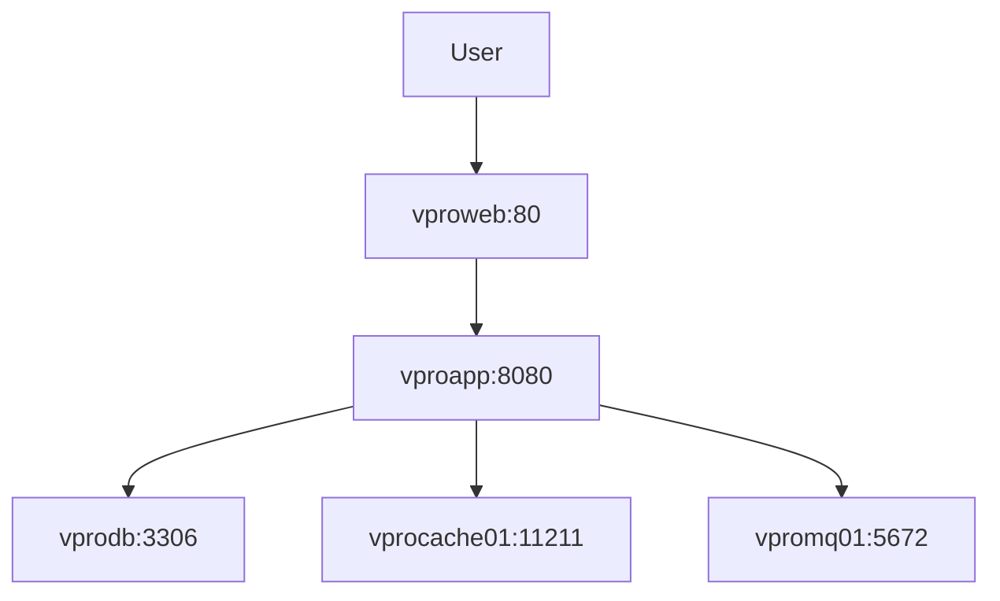

# vProfile Microservices Deployment


A containerized microservices architecture for the vProfile application stack.

## Features
- Full-stack deployment with Docker Compose
- MySQL database service
- RabbitMQ message broker
- Memcached caching layer
- Tomcat application server
- Nginx reverse proxy
- Persistent storage volumes
- Isolated bridge network

## Prerequisites
- Docker Engine 20.10+
- Docker Compose 2.0+
- 4GB+ RAM recommended
- 5GB+ free disk space

## Architecture Overview


## Getting Started

### 1. Clone Repository
```bash
git clone https://github.com/ibrahim-reda-2001/ZeroSploit-Training.git
cd day-2
cd code  
```

### 2. Build Images
```bash
docker-compose build
```

### 3. Start Services
```bash
docker-compose up -d
```

### 4. Verify Deployment
```bash
docker-compose ps
```

### 5. Access Application
- Main application: http://localhost:80
- Tomcat direct access: http://localhost:8080
- MySQL admin (use client): localhost:3306

## Service Details

| Service       | Image                    | Ports       | Environment Variables        |
|---------------|--------------------------|-------------|-------------------------------|
| vprodb        | ibrahimelmsery1/vprofiledb | 3306:3306   | MYSQL_ROOT_PASSWORD=vprodbpass|
| vprocache01   | memcached                | 11211:11211 | -                             |
| vpromq01      | rabbitmq                 | 5672:5672   | RABBITMQ_DEFAULT_USER=guest   |
|               |                          |             | RABBITMQ_DEFAULT_PASS=guest   |
| vproapp       | ibrahimelmsery1/vprofileapp | 8080:8080 | -                             |
| vproweb       | ibrahimelmsery1/vprofileweb | 80:80     | -                             |

## Configuration Notes

1. **Database Configuration**:
   - Update `vprofile-project/src/main/resources/application.properties` to match:
     ```properties
     spring.datasource.url=jdbc:mysql://vprodb:3306/accountDB
     spring.datasource.username=root
     spring.datasource.password=vprodbpass
     ```

2. **RabbitMQ Configuration**:
   Ensure application properties match service name:
   ```properties
   spring.rabbitmq.host=vpromq01
   spring.rabbitmq.port=5672
   spring.rabbitmq.username=guest
   spring.rabbitmq.password=guest
   ```

## Maintenance

### Stop Services
```bash
docker-compose down
```

### Remove Volumes
```bash
docker-compose down -v
```

### View Logs
```bash
docker-compose logs -f vproapp  # Replace with service name
```

## Troubleshooting

**Common Issues**:
1. **Port Conflicts**:
   ```bash
   Error: Port 80 already in use
   ```
   Stop existing web servers or modify `docker-compose.yml` ports mapping.

2. **Database Connection Issues**:
   Verify container names match application properties exactly.

3. **Build Failures**:
   ```bash
   docker-compose build --no-cache
   ```

4. **Application Startup Order**:
   If services fail to connect, use restart policy:
   ```yaml
   depends_on:
     - vprodb
     - vprocache01
     - vpromq01
   ```


## Acknowledgements
- Original vProfile Project: [hkhcoder/vprofile-project](https://github.com/hkhcoder/vprofile-project)
- Docker Documentation: [docs.docker.com](https://docs.docker.com/)